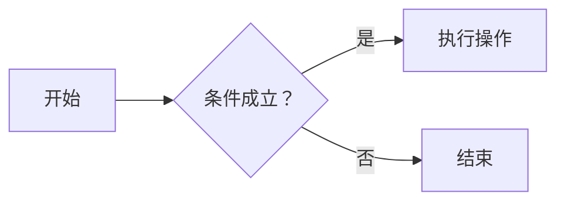
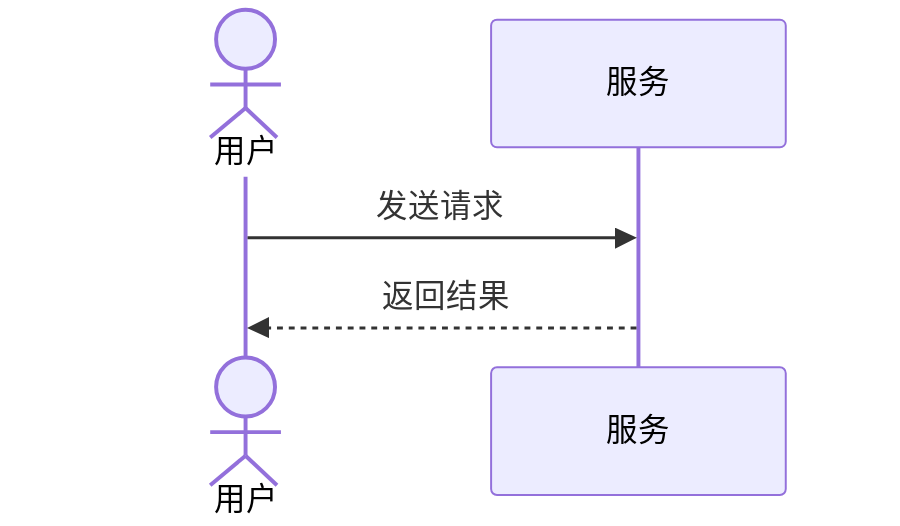
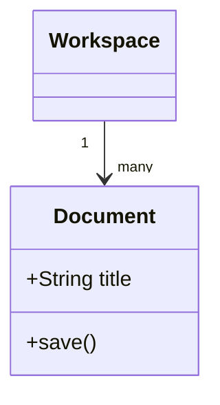
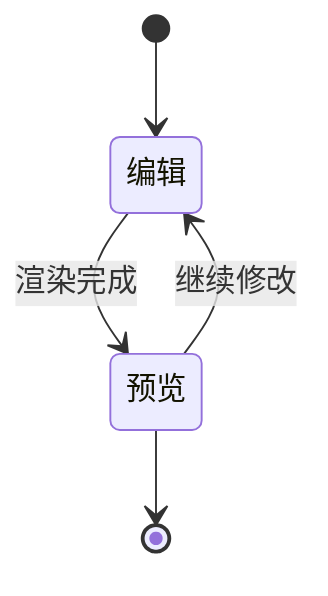
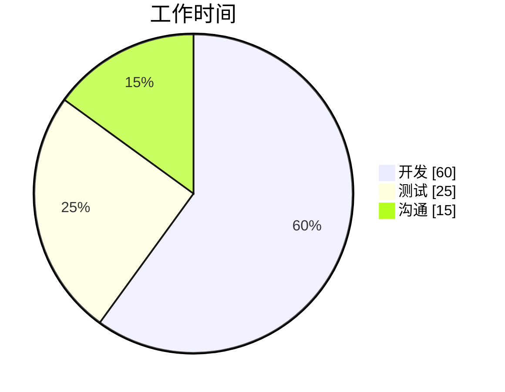
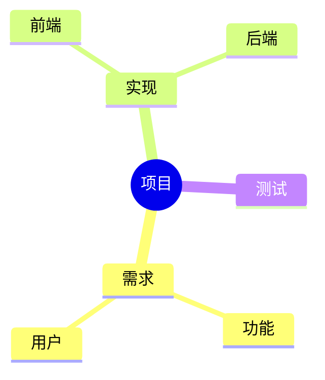
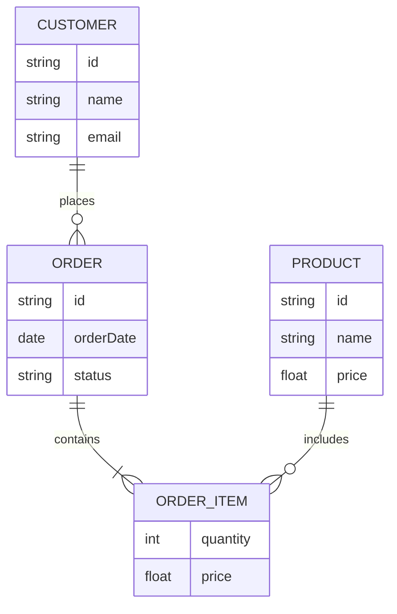
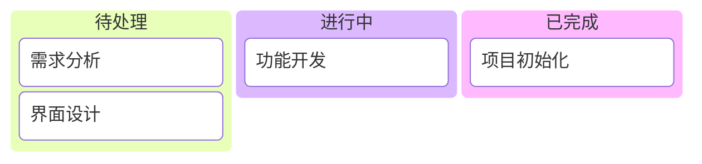
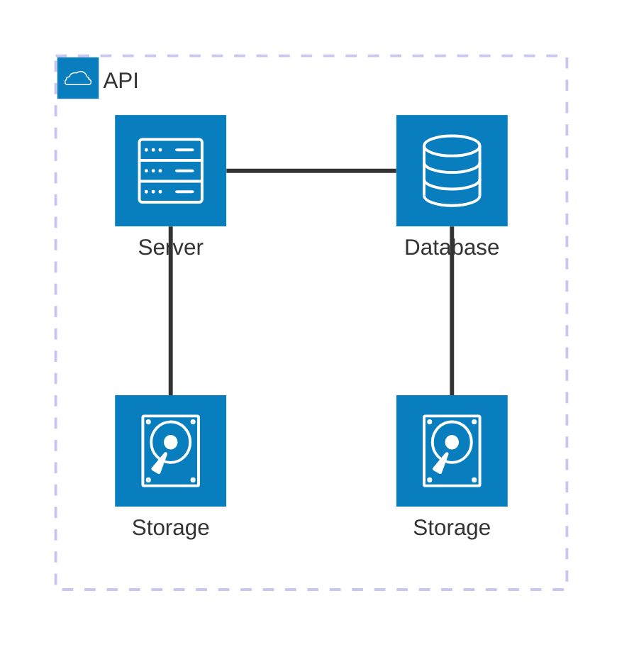

# Mermaid 常用图表示例

流程图、时序图、类图、状态图、饼图、思维导图、ER 图、看板和架构图。图表支持缩放与放大查看。

## 流程图

```mermaid
flowchart LR
  A[开始] --> B{条件成立？}
  B -->|是| C[执行操作]
  B -->|否| D[结束]
```

## 时序图

```mermaid
sequenceDiagram
  actor U as 用户
  participant S as 服务
  U->>S: 发送请求
  S-->>U: 返回结果
```

## 类图

```mermaid
classDiagram
  class Document {
    +String title
    +save()
  }
  Workspace "1" --> "many" Document
```

## 状态图

```mermaid
stateDiagram-v2
  [*] --> 编辑
  编辑 --> 预览: 渲染完成
  预览 --> 编辑: 继续修改
  预览 --> [*]
```

## 饼图

```mermaid
pie showData title 工作时间
  "开发" : 60
  "测试" : 25
  "沟通" : 15
```

## 思维导图

```mermaid
mindmap
  root((项目))
    需求
      功能
      用户
    实现
      前端
      后端
    测试
```

## 实体关系图

```mermaid
erDiagram
    CUSTOMER ||--o{ ORDER : places
    ORDER ||--|{ ORDER_ITEM : contains
    PRODUCT ||--o{ ORDER_ITEM : includes
    CUSTOMER {
        string id
        string name
        string email
    }
    ORDER {
        string id
        date orderDate
        string status
    }
    PRODUCT {
        string id
        string name
        float price
    }
    ORDER_ITEM {
        int quantity
        float price
    }
```

## 看板

```mermaid
kanban
  待处理
    [需求分析]
    [界面设计]
  进行中
    [功能开发]
  已完成
    [项目初始化]
```

## 系统架构图

```mermaid
architecture-beta
    group api(cloud)[API]

    service db(database)[Database] in api
    service disk1(disk)[Storage] in api
    service disk2(disk)[Storage] in api
    service server(server)[Server] in api

    db:L -- R:server
    disk1:T -- B:server
    disk2:T -- B:db
```
