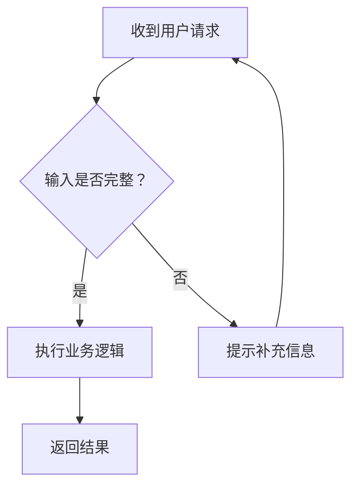
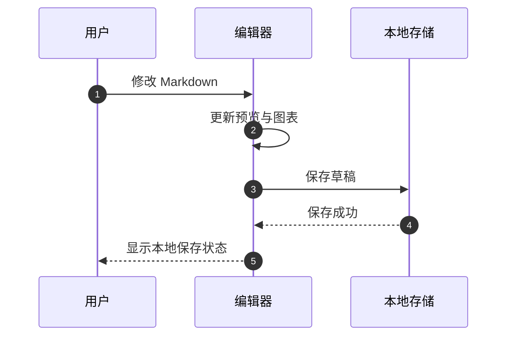
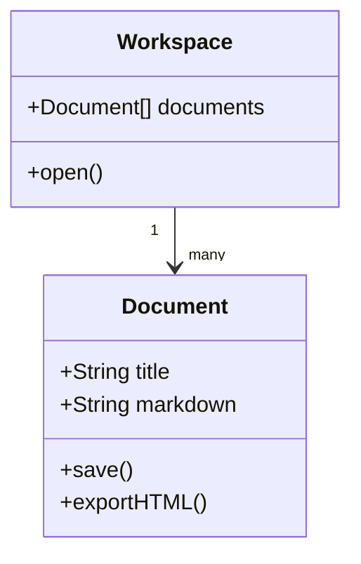
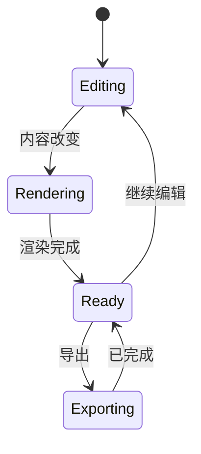

# Mermaid 示例集

这些图表用于检查中文、多图同时渲染和导出效果。

## 中文流程图

```mermaid
flowchart TD
  A[收到用户请求] --> B{输入是否完整？}
  B -->|是| C[执行业务逻辑]
  B -->|否| D[提示补充信息]
  C --> E[返回结果]
  D --> A
```

## 时序图

```mermaid
sequenceDiagram
  autonumber
  participant U as 用户
  participant E as 编辑器
  participant S as 本地存储
  U->>E: 修改 Markdown
  E->>E: 更新预览与图表
  E->>S: 保存草稿
  S-->>E: 保存成功
  E-->>U: 显示本地保存状态
```

## 类图

```mermaid
classDiagram
  class Document {
    +String title
    +String markdown
    +save()
    +exportHTML()
  }
  class Workspace {
    +Document[] documents
    +open()
  }
  Workspace "1" --> "many" Document
```

## 状态图

```mermaid
stateDiagram-v2
  [*] --> Editing
  Editing --> Rendering: 内容改变
  Rendering --> Ready: 渲染完成
  Ready --> Editing: 继续编辑
  Ready --> Exporting: 导出
  Exporting --> Ready: 已完成
```
